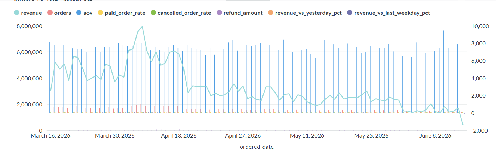
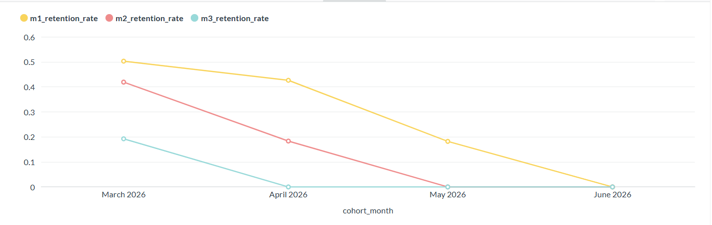
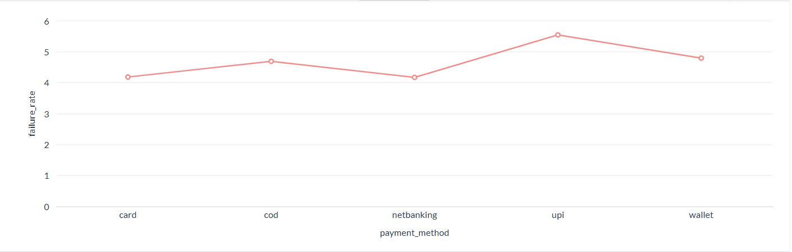
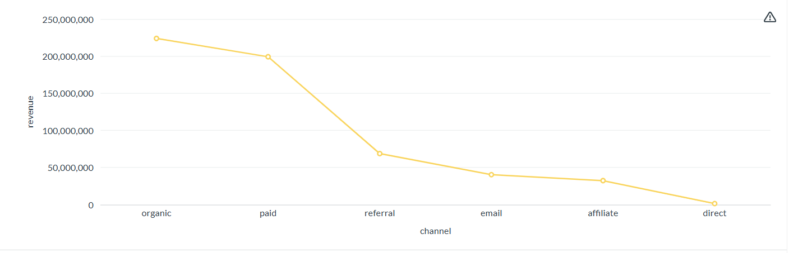

# 🛒 Ecommerce SQL Business Case Study

## 📌 Overview

This project contains **10 SQL business analyses** performed on an ecommerce dataset. The objective was to go beyond writing SQL queries and understand how data can be used to solve real business problems and support decision-making.

Each query focuses on a different business area, including sales, customer behavior, marketing, product performance, payments, shipping, and customer lifetime value.

## 🗄️ Database Schema

The ER diagram below shows the structure of the ecommerce database and the relationships between the tables.

🔗 **Detailed Project Documentation:** [Notion](https://tungsten-tuck-a3f.notion.site/What-10-SQL-Queries-Told-Me-About-This-Business-3b9cd9dc106a800c86dac76a00ae639b)

🔗 **Connect with me:** [LinkedIn](https://www.linkedin.com/in/archana-o-0b6862354)

---

## 📊 Business Questions Answered

- 📈 Daily Business Performance Analysis
- 👥 Customer Cohort Retention
- 🎯 Marketing Funnel Conversion
- 🛍️ Product Revenue & Refund Analysis
- 📦 Category Sales & Return Rate
- 💳 Payment Failure Analysis
- 🚚 Shipping Carrier Performance
- 💰 Customer Lifetime Value (LTV) Segmentation
- 🔄 Repeat Purchase Interval Analysis
- 📣 First Touch vs Last Touch Marketing Attribution

---

## 📊 Query Results & Business Findings

| SQL File | Business Question | Headline Finding |
|---|---|---|
| [`01_daily_business_summary.sql`](queries/01_daily_business_summary.sql) | How is the business performing on a daily basis? | Revenue fell **74.25%** on June 14, driven by a drop in both orders and AOV. |
| [`02_monthly_cohort_retention.sql`](queries/02_monthly_cohort_retention.sql) | How well does the business retain customers after signup? | The March 2026 cohort declined from **50% retention in Month 1 to 19% by Month 3**. |
| [`03_FunnelConversionbyAcquisitionChannel.sql`](queries/03_FunnelConversionbyAcquisitionChannel.sql) | How does the marketing funnel convert across channels? | Funnel performance varies by channel, with measurable drop-offs between product views, cart, checkout and purchase. |
| [`04_TopProductsbyNetRevenue.sql`](queries/04_TopProductsbyNetRevenue.sql) | Which products generate revenue and how do refunds affect performance? | Eastlight Clarity ANC Headphones generated 918,445 in gross revenue and 918,445 in net revenue from 46 orders and 55 units sold. With zero returns and zero refunds, there was no reduction in revenue due to product returns, making it the strongest-performing product in the result. |
| [`05_CategoryHealth.sql`](queries/05_CategoryHealth.sql) | Which categories generate sales and experience higher returns? | Smartwatch generated the highest revenue at 59,737,326, followed by Headphones at 38,105,918 and Speakers at 32,969,256. Skincare recorded the highest number of orders (5,770) and units sold (7,894). Accessories had the highest return rate at 3.14%, while Bedding had the lowest at 2.44%. |
| [`06_PaymentFailureAnalysis.sql`](queries/06_PaymentFailureAnalysis.sql) | Which payment methods fail most and why? | UPI had the highest failure rate at **5.54%**, with `GATEWAY_TIMEOUT` contributing **23.63%** of UPI failures. |
| [`07_Delivery_SLA_BreachbyCarrier_ShippingMethod.sql`](queries/07_Delivery_SLA_BreachbyCarrier_ShippingMethod.sql) | Which shipping carriers and methods have the most delivery delays? | EcomExpress Express had a **21.45% late-delivery rate**, compared with **5.66% for Bluedart Standard**. |
| [`08_Customer_LTV_Bucket_Share_of_Revenue.sql`](queries/08_Customer_LTV_Bucket_Share_of_Revenue.sql) | How is customer lifetime value distributed? | Customer Shreya Menon (ID:2,570) generated the highest revenue at 1,335,804.14 from 155 orders, followed closely by Customer Ema Wilson (ID:642) with 1,335,583.18 from 148 orders. Customer Reyansh Deshpande (ID:371) placed the highest number of orders among the displayed customers (168) and generated 1,103768.52 in revenue.All displayed customers fall into the 20,000+ LTV bucket, indicating a high-value customer segment with substantial revenue contribution .₹20,000+ LTV customer segment drives 88.4% of total company revenue|
| [`09_Repeat_Purchase_Interval.sql`](queries/09_Repeat_Purchase_Interval.sql) | How frequently do customers make repeat purchases? | Repeat customers had a **6-day median** and **10.58-day average** gap between orders. |
| [`10_FirstTouch_vs_LastTouch_Revenue_by_Channel.sql`](queries/10_FirstTouch_vs_LastTouch_Revenue_by_Channel.sql) | How does revenue attribution change between first-touch and last-touch models? | Organic was the highest-performing channel, generating 111,902,213.06 in revenue and accounting for 39.56% of total revenue. Paid followed with 99,564,080.00 in revenue and a 35.20% revenue share.Referral, Email, and Affiliate contributed 12.15%, 7.13%, and 5.71% of revenue respectively. |

---
## 📊 Visual Analysis

The SQL results were also visualized to make key business insights easier to interpret and communicate.

### 📈 Daily Business Performance

### 👥 Customer Cohort Retention

### 💳 Payment Failure Analysis

### 📣 Marketing Attribution

---
## 🛠 How to Run

### Prerequisites

- PostgreSQL
- pgAdmin or any PostgreSQL client
- The ecommerce database/schema used for this project

### Steps

1. Create the ecommerce database.
2. Load the provided ecommerce tables and data.
3. Make sure the `ecom` schema is available.
4. Open the SQL files from the [`queries`](queries/) folder.
5. Run each query in PostgreSQL/pgAdmin.
6. Review the output and compare it with the business findings documented in this README and the project documentation.

---

## 🛠 SQL Concepts Used

- Common Table Expressions (CTEs)
- Window Functions (`LAG`, `LEAD`, `ROW_NUMBER`)
- Conditional Aggregation
- Cohort Analysis
- Marketing Attribution
- Percentile Functions (`PERCENTILE_CONT`)
- Aggregate Functions
- Joins & Subqueries

---

## 💡 Key Learnings

Through this project, I learned that SQL is much more than a querying language—it is a tool for answering business questions.

Some of the key takeaways include:

- Revenue should always be analyzed alongside refunds and cancellations.
- Customer retention is a stronger indicator of long-term business growth than customer acquisition alone.
- Marketing channels should be evaluated based on conversions, not just traffic.
- Net revenue provides a better measure of product performance than gross sales.
- Payment success and shipping performance directly influence customer satisfaction.
- Customer Lifetime Value (LTV) helps identify high-value customers for retention and loyalty programs.

---

## 🎯 Outcome

This project strengthened both my SQL skills and my ability to think from a business perspective. Instead of focusing only on writing queries, I learned how to interpret results, identify trends, and generate actionable business insights.

---

⭐ **If you found this project interesting, feel free to explore the SQL queries and share your feedback!**
